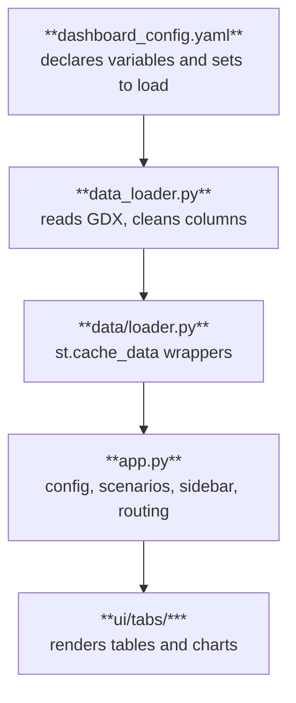

# highRES Dashboard Documentation

- [highRES Dashboard Documentation](#highres-dashboard-documentation)
  - [1. Overview](#1-overview)
  - [2. Getting Started](#2-getting-started)
    - [2.1 Prerequisites](#21-prerequisites)
    - [2.2 Installation](#22-installation)
  - [3. Configuration](#3-configuration)
    - [3.1 Startup Validation](#31-startup-validation)
    - [3.2 Supported scenario folder structures:](#32-supported-scenario-folder-structures)
    - [3.3 Using Regional or Custom Zones](#33-using-regional-or-custom-zones)
  - [4. Architecture](#4-architecture)
    - [4.1 Data flow](#41-data-flow)
    - [4.2 Key files and their responsibilities](#42-key-files-and-their-responsibilities)
  - [5. Dashboard Tabs](#5-dashboard-tabs)
    - [Overview](#overview)
    - [Map](#map)
    - [Explore Capacity](#explore-capacity)
    - [VRE Deployment](#vre-deployment)
    - [Scenarios](#scenarios)
  - [6. Scenario Loading and State](#6-scenario-loading-and-state)
  - [7. Constants and Lookups](#7-constants-and-lookups)
  - [8. Adding new GDX data to the dashboard](#8-adding-new-gdx-data-to-the-dashboard)
    - [8.1 Register the variable or set](#81-register-the-variable-or-set)
    - [8.2 Check that its columns survive the cleaning step](#82-check-that-its-columns-survive-the-cleaning-step)
    - [8.3 Use the data in the Streamlit app](#83-use-the-data-in-the-streamlit-app)
  - [9. Known Issues and Limitations](#9-known-issues-and-limitations)
    - [9.1 Transmission costs are misattributed when filtered by zone](#91-transmission-costs-are-misattributed-when-filtered-by-zone)
    - [9.2 GeoJSON path is relative to project root](#92-geojson-path-is-relative-to-project-root)
    - [9.3 Regional scenarios require manual GeoJSON swap](#93-regional-scenarios-require-manual-geojson-swap)
    - [9.4 `COST_COMPONENTS` labels are raw GDX variable names](#94-cost_components-labels-are-raw-gdx-variable-names)
    - [9.5 Scenarios tab loads all scenarios sequentially](#95-scenarios-tab-loads-all-scenarios-sequentially)
    - [9.6 `gdxcc` warning on startup](#96-gdxcc-warning-on-startup)
  - [10. Ideas for Further Work](#10-ideas-for-further-work)

## 1. Overview

The **highRES Dashboard** is a Streamlit-based web application for visualising and exploring results from the highRES energy system model. It was developed as a summer research project at SINTEF/University of Oslo and is designed to work with results created by the `highRES-Europe-WF` workflow.

The dashboard loads scenario results directly from GDX files produced by the GAMS optimisation model. It is intentionally decoupled from the model run itself, researchers run the model first, then point the dashboard at the results folder.

---

## 2. Getting Started

### 2.1 Prerequisites

- **GAMS** installed on the machine (required by `gdxpds` to read GDX files)
- `conda` or `mamba` package manager

**Find GAMS path:**
Run this in your terminal and add the path to `gams_path`:

```bash
which gams
```

or

```bash
whereis gams
```

and use the returned path as gams_path.

_Alternatively open `GAMS Studio` and navigate to `Help` then select `GAMS Licensing` and the path will be next to `System Directory:`_

### 2.2 Installation

1. **Clone the fork and check out the dashboard branch:**

   ```bash
   git clone https://github.com/gjermundmyrvang/highRES-Europe-WF-dashboard.git
   git checkout feature/results-dashboard
   ```

2. **Create and activate the dedicated conda environment:**

   ```bash
   mamba env create -f dashboard/environment.yml
   mamba activate highres-dashboard
   ```

3. **Configure the dashboard** (see Section 3), then run from the project root:
   ```bash
   streamlit run dashboard/app.py
   ```

---

## 3. Configuration

The file `dashboard/dashboard_config.yaml` controls where the dashboard looks for data. Edit this before running:

```yaml
results_path: dashboard/example_scenarios # default folder containing 'dummy' scenarios with just 48h data
geojson_path: dashboard/shapes/europe_onshore.geojson # Can be replaced with custom geojson files
gams_path: /Library/Frameworks/GAMS.framework/... # path to GAMS installation (see instructions below on how to find path)
```

### 3.1 Startup Validation

On startup, `app.py` passes the configuration through `check_user_config()` to ensure all paths exist on disk before executing GDX operations.

In addition, scenario discovery raises explicit `FileNotFoundError` exceptions if the target directory contains no valid model outputs:

- **Path Existence:** `results_path`, `geojson_path`, and `gams_path` are checked for existence.
- **`load_standard_scenarios()`**: Searches for `base_path/*/results.gdx`. Raises `FileNotFoundError` if no nested scenario files are found.
- **`load_custom_scenarios()`**: Searches for `folder_path/*.gdx`. Raises `FileNotFoundError` if no flat GDX files are found.
- **`load_scenarios()`**: Aggregates standard and custom checks. If neither path type yields scenarios, it triggers a clean UI alert in Streamlit (`st.error()`) and halts execution (`st.stop()`), preventing downstream `KeyError` or layout crashes.

### 3.2 Supported scenario folder structures:

- **Standard (model-generated):** `work/scenario_name/results.gdx`
- **Custom (flat):** `custom_folder/scenario_name.gdx`

Users can also add extra scenario folders at runtime via the sidebar without touching the config file.
**NB:** runtime added scenarios currently only works with **Custom (flat):** `custom_folder/scenario_name.gdx`.

### 3.3 Using Regional or Custom Zones

If your GDX file uses sub-national or custom zones (e.g., `NO020` for Innlandet) rather than standard 2-letter country codes, you must update `geojson_path` in `dashboard/dashboard_config.yaml`. Point it to a regional GeoJSON file where the feature properties (`properties.index`) directly match the `z`-values in your GDX file. This ensures map visualizations and land area calculations render correctly.

---

## 4. Architecture

### 4.1 Data flow

```

GDX file > data_loader.py (load + clean) > data/_.py (transform) > ui/tabs/_.py (render)

```



### 4.2 Key files and their responsibilities

| File / Folder                       | Responsibility                                                                                                                                                                                                                                                                                                       |
| :---------------------------------- | :------------------------------------------------------------------------------------------------------------------------------------------------------------------------------------------------------------------------------------------------------------------------------------------------------------------- |
| `app.py`                            | Entry point. Loads config, discovers scenarios, renders sidebar and bottom bar, passes data to each tab.                                                                                                                                                                                                             |
| `data_loader.py`                    | Reads GDX files via `gdxpds`. Handles lazy loading, cleans dataframes (`clean_results`), loads GAMS sets (`load_sets`). Also handles config loading and scenario discovery. Not the same file as `data/loader.py` below, note the similar name.                                                                      |
| `data/loader.py`                    | Caching layer that sits between `app.py` and `data_loader.py`. Wraps `load_results` + `clean_results` in `st.cache_data` (`load_scenario`), wraps `load_sets` (`load_sets_cached`), and provides `load_scenario_summary`, which combines both plus and creates cached summary dicts used in scenario comparison tab. |
| `data/constants.py`                 | Shared lookup tables: `TECH_COLORS`, `TECH_ICONS`, `COST_COMPONENTS`, country name mapping, `cap2area` factors, area references. All lookups have safe fallbacks.                                                                                                                                                    |
| `data/utilization.py`               | Core calculation functions: `calculate_utilization()` (country level), `calculate_utilization_region()` (regional level), `calculate_country_land_use()`.                                                                                                                                                            |
| `data/capacity.py`                  | `capacity_summary()` — aggregates total/new installed capacity split by VRE vs non-VRE.                                                                                                                                                                                                                              |
| `data/cost_transformer.py`          | Currency fetching (Frankfurter API), inflation adjustment, formatting. Handles offline mode.                                                                                                                                                                                                                         |
| `data/transformer.py`               | Misc data transformations including `load_country_areas()` which calculates km² from GeoJSON using `geopandas`.                                                                                                                                                                                                      |
| `ui/sidebar.py`                     | Renders the sidebar: scenario folder management, add-custom-scenarios UI.                                                                                                                                                                                                                                            |
| `ui/tabs/overview/`                 | Overview tab: total system cost with inflation/currency adjustment, cost breakdown by category, capacity headline metrics.                                                                                                                                                                                           |
| `ui/tabs/capacity/`                 | Explore Capacity tab: installed capacity by tech and country, pie charts with country filter.                                                                                                                                                                                                                        |
| `ui/tabs/utilization/`              | VRE Deployment tab: installed vs potential in GW or km², country land use analysis with drill-down.                                                                                                                                                                                                                  |
| `ui/tabs/map/`                      | Map tab: choropleth map coloured by selected technology's installed capacity. Click a country for detail view.                                                                                                                                                                                                       |
| `ui/tabs/scenarios/`                | Scenarios tab: comparison table across all loaded scenarios, base scenario selection, delta highlighting, technology comparison chart.                                                                                                                                                                               |
| `ui/tabs/shared/`                   | Shared UI components used across multiple tabs: `key_data`, `cost_breakdown`, `land_use_barchart`.                                                                                                                                                                                                                   |
| `ui/components/filter_countries.py` | Reusable country multiselect filter. Defaults to first five countries if no default is provided.                                                                                                                                                                                                                     |
| `dashboard_config.yaml`             | User-facing configuration file. Controls results path, geojson path, and gams path.                                                                                                                                                                                                                                  |
| `environment.yml`                   | Dedicated conda environment for the dashboard. Install with: `mamba env create -f dashboard/environment.yml`                                                                                                                                                                                                         |

---

## 5. Dashboard Tabs

### Overview

The landing tab for any scenario. Shows total system cost (raw GBP, inflation-adjusted, converted to user-selected currency via live Frankfurter API), a cost breakdown by category (Generation / Storage / Transmission) using a segmented control, and headline capacity metrics. Works offline with a manual rate input fallback.

### Map

Choropleth map of installed capacity coloured by the selected technology. Users pick a technology from the controls panel on the left. Clicking a country opens a detail view showing installed capacity per tech for that country. The map validates that GDX zone codes match the GeoJSON index before rendering, and shows a clear warning if they don't (e.g. when a regional scenario is loaded but the country-level GeoJSON is configured).

### Explore Capacity

Shows installed capacity (total or new) broken down by technology and country. Includes pie charts per country with a country filter. Filters for 'All technologies' or 'Renewables only'.

### VRE Deployment

Compares newly installed VRE capacity against available potential. Toggle between Power (GW) and Area (km²). The area view optionally shows how much of each country's total land area is occupied by VRE. Uses `calculate_utilization()` and `calculate_country_land_use()` from `data/utilization.py`. HydroRoR is always excluded because its potential is stored as `+INF` in the GDX.

### Scenarios

Loads all available scenarios and builds a comparison table with total capacity, VRE capacity, and cost columns. A base scenario can be selected, then all other rows then show deltas ($\Delta$) against the base. The base scenario row is highlighted. A technology comparison chart below the table shows installed capacity for a selected technology across all scenarios, with a dashed reference line at the base scenario value. Scenario data is cached with `@st.cache_data` to avoid reloading large GDX files on every interaction.

---

## 6. Scenario Loading and State

- Scenarios are discovered at startup from the configured `results_path`. Users can add extra folders at runtime via the sidebar, these are stored in `st.session_state.added_scenarios` and merged with the auto-discovered scenarios.
- The active scenario is selected via a sticky bottom bar (`st.bottom`) that shows either a dropdown or a segmented control depending on the user's preference. Switching scenarios triggers a toast notification.

---

## 7. Constants and Lookups

All shared lookup tables live in `data/constants.py`. **Key design decision:** every lookup has a safe fallback so the dashboard never crashes on an unknown technology or zone code. For example:

- `get_country_name(z)` returns the full country name for known 2-letter codes, otherwise returns `z` as-is (safe for regional codes like `NO02`).
- `TECH_COLORS` and `TECH_ICONS` both fall back to a neutral default for unknown technologies.
- `cap2area` factors are read from the GDX `gen_cap2area` table when available, with a hardcoded fallback dict.
- `COST_COMPONENTS` maps category names to GDX variable names. The keys (display labels) are placeholders, this should be updated to proper descriptions.

---

## 8. Adding new GDX data to the dashboard

This section walks through the full process of exposing a new variable or set from the GDX results in the dashboard, using the last one I added (`var_tot_store_pcap`) as a concrete example.

There are three steps: register the variable, make sure its columns survive the cleaning step, and use it in the app.

### 8.1 Register the variable or set

Add the name of the table or set to `dashboard_config.yaml`, under `variables`:

```yaml
variables: [
    ...
    "var_tot_store_pcap",
  ]
```

This tells the loader to pull this variable out of the GDX file at all.

### 8.2 Check that its columns survive the cleaning step

Once loaded, every table passes through a cleaning function that drops columns not considered relevant. This filter only knows about column names seen so far, it does not automatically account for every possible dimension name a new variable might use.

Open `data_loader.py` and find the `clean_results` function. Check the `dims` list:

```py
dims = [
    c
    for c in df.columns
    if c in ("g", "r", "z", "z_alias", "trans", "vre")
]
```

If your new variable uses a dimension name that isn't in this list, its data will be silently dropped during cleaning, even though step 8.1 loaded it correctly. In this example, the storage table identifies technology/type using `s` rather than `g`, so `s` had to be added:

```py
if c in ("g", "s", "r", "z", "z_alias", "trans", "vre")  # added "s"
```

**Before moving on:** check your new variable's actual column names (e.g. by inspecting the raw GDX table or printing `df.columns`) and confirm every dimension you need is present in this list. This is the step most likely to bite you, since nothing will error, the data will just silently be incomplete.

### 8.3 Use the data in the Streamlit app

Once steps 8.1 and 8.2 are done, `load_scenario(scenario_gdx, gams_path, variables)` in `app.py` will include your new variable in its output.

`data` is a `dict` mapping table name (`str`) to a pandas `DataFrame`. So to access the new table:

```py
tot_store_df = data["var_tot_store_pcap"]
```

`tot_store_df` is now a regular pandas DataFrame you can use anywhere in the app.

**Sanity check before building anything on top of it:** render it directly to confirm it loaded and cleaned correctly:

```py
tot_store_df = data["var_tot_store_pcap"]
st.dataframe(tot_store_df)
```

Add this temporarily anywhere (e.g. directly in `app.py`), rerun the app, and inspect the table.

⚠️ **Since this is a newly registered variable, you must clear Streamlit's cache before rerunning**, otherwise you'll still see the old cached data (or an error) rather than the new table. Clear cache via the menu (⋮ → "Clear cache") or by pressing `C` in the running app, then rerun (`R`).

---

## 9. Known Issues and Limitations

### 9.1 Transmission costs are misattributed when filtered by zone

**Where:** `render_cost_breakdown()` → `generate_total_category_breakdown()`
→ `generate_cost_breakdown()` → `_get_value()`

**What's wrong:** The cost breakdown function works correctly for the
overview tab, where it aggregates totals across all zones. But it's
reused in the country-detail view, where a specific zone (`country`)
is passed in and used to filter the data.

This filtering is fine for categories like "Generation" or "Storage",
which genuinely belong to a single zone. But "Transmission" costs
represent energy transfer _between_ zones → they're not naturally
attributable to just one country. Right now, `_get_value()` filters
transmission data the same naive way as everything else
(`df[df["z"] == selected_country]`), which doesn't account for
direction (import vs export) or split the cost sensibly between the
two zones involved.

**Needs:** A decision on how transmission costs should be attributed
or split per zone before the country-detail view can be trusted for
that category. See inline TODO's in `generate_total_category_breakdown()`
and `_get_value()` for pointers to the exact lines.

**Status:** Not fixed. Overview tab is unaffected (uses `selected_country=None`).

---

### 9.2 GeoJSON path is relative to project root

**Where:** Config file, `geojson_path` setting.

**What's wrong:** The path is relative rather than absolute, so it
resolves against whatever directory Streamlit is launched from. If the
app is started from a different working directory than expected, the
path will break.

**Current workaround** Specify clearly in the
dashboard/README that the app must always be launched from the project root.

**Status:** Not fixed. Works as long as launch directory is consistent.

---

### 9.3 Regional scenarios require manual GeoJSON swap

**Where:** Config (`geojson_path`), map-rendering logic that checks `z` values.

**What's wrong:** When a scenario uses sub-national regions (e.g. `z`
values like `NO02` instead of country codes), the default country-level
GeoJSON file no longer matches the data. The dashboard detects this
mismatch and shows a warning, but doesn't resolve it automatically.
The user has to manually update `geojson_path` to point to the correct
regional GeoJSON file.

**Needs:** Either an auto-detection step that picks the right GeoJSON
based on the `z` values present in the data, or at minimum a clearer
in-app prompt telling the user exactly which file to switch to and where.

**Status:** Not fixed. Manual workaround (updating config) exists and
is surfaced via a warning.

---

### 9.4 `COST_COMPONENTS` labels are raw GDX variable names

**Where:** `COST_COMPONENTS` definition.

**What's wrong:** The display labels shown to users are still the raw
variable names from the GDX source data, not human-readable descriptions.
This makes the UI harder to parse for anyone unfamiliar with the
underlying model's naming conventions.

**Needs:** A mapping from each raw variable name to a clean,
human-readable label for display purposes only (keep the raw names for
internal lookups/joins).

**Status:** Not fixed. UI issue, no functional impact.

---

### 9.5 Scenarios tab loads all scenarios sequentially

**Where:** Scenarios tab comparison table.

**What's wrong:** With 100+ scenarios, the comparison table builds by
loading each scenario one at a time. Caching helps on reruns, but the
first load is slow, and this will scale worse as scenario count grows.

**Needs:** Consider batch loading, parallelization, or lazy-loading
only the scenarios currently visible/selected in the table, rather than
loading everything up front.

**Status:** Not fixed. Caching is a partial mitigation, not a real fix.

---

### 9.6 `gdxcc` warning on startup

**What you'll see:** `Unable to load gdxcc with default GAMS directory 'None'...`

**Status:** The app functions correctly despite this warning,
GAMS/gdxcc is being resolved through path set in `dashboard_config.yaml`. Safe to ignore.
Could be silenced by explicitly calling `gdxpds.load_gdxcc(path)` before
importing pandas, but not necessary for functionality.

---

## 10. Ideas for Further Work

- **Improve Map tab** - this could be improved to be more dynamic, not only using capacity data, but also other tables like costs or storage and let users start by selecting a dimension to focus on
- **Transmission tab** — visualise `var_tot_trans_pcap` as lines on the map, thickness proportional to capacity, coloured by transmission type (HVAC/HVDC).
- **Scenario comparison charts** — extend the Scenarios tab with VRE utilisation comparison, country-level diffs or other relevant tables
- **Split-view for two scenarios side by side** — could useful for direct visual comparison without the table.
